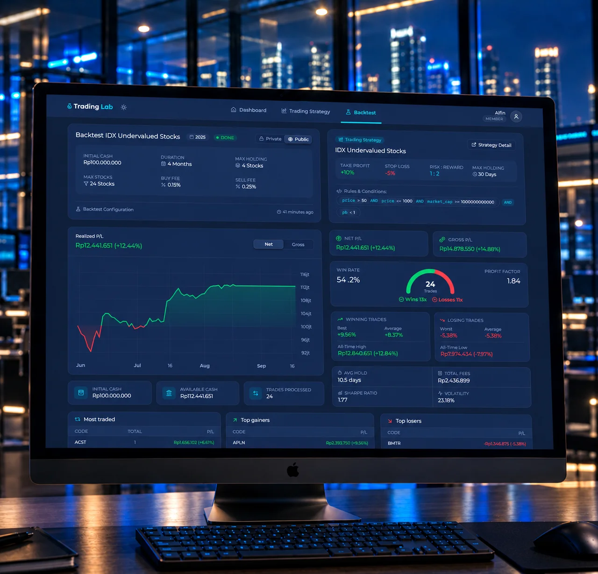

<div align="center">

<picture>
  <source media="(prefers-color-scheme: dark)" srcset="./frontend/static/logo-dark.svg">
  <source media="(prefers-color-scheme: light)" srcset="./frontend/static/logo-light.svg">
  
</picture>

---

**AI-powered backtesting platform for IDX**

Trading Lab helps Indonesian retail traders to validate and improve their trading strategies<br />before risking real money, by providing a reliable backtesting platform.

<p align="center">
    <a href="https://www.rust-lang.org/"></a>
    <a href="https://svelte.dev/"></a>
    <a href="https://sectors.app"></a>
</p>

</div>

<br />



---

## Overview

**Trading Lab** is a backtesting platform built for the Indonesia Stock Exchange (IDX). It enables traders to easily build custom multi-condition trading strategies (AI-Powered), test them against historical market data, analyze risk and performance metrics, and share winning strategies with the community.

- 🌐 **Live Preview**: [https://trading-lab.xyz](https://trading-lab.xyz)
- 🎬 **1-min Teaser**: [https://youtu.be/_gCJQdS6fKU](https://youtu.be/_gCJQdS6fKU)
- 🎥 **3-min Demo**: [https://youtu.be/1f50fLwToxE](https://youtu.be/1f50fLwToxE)

## Features

### 🛠️ Visual Strategy Builder
- **Visual Condition Builder**: Construct dynamic, multi-group screening rules with customizable intra-group and inter-group logical connectors (`AND` / `OR`).
- **Comprehensive IDX Metrics**: Screen stocks across categorized financial metrics, including Valuation (P/E, P/B), Profitability (ROE, ROA), Technical Price, Volume & Value indicators, and Foreign Flow.
- **Dynamic Comparisons**: Compare variables against fixed numeric thresholds, percentage changes, or cross-metric conditions.

### ⚡ Reliable Backtest Engine
- **Asynchronous Simulation**: High-performance historical simulation engine running in non-blocking Tokio background tasks.
- **Real Market Data Integration**: Powered by Sectors.app IDX market data with permanent Redis caching, cache-miss telemetry, and 429 rate-limit backoff retries.
- **Customizable Simulation Parameters**: Configure starting capital, maximum simultaneous portfolio holdings, broker commission fees (buy/sell), and historical durations (1, 3, 6, 12 months).

### ✨ AI-Powered
- **AI Suggestions**: Offering one-click "Accept" or "Ignore" trading strategy suggestions to optimize risk-reward parameters, holding days, and rule conditions.
- **AI Insights**: Generates a actionable qualitative breakdown on completed backtests.

### 📊 Deep Analytics & Interactive Visualizations
- **Key Performance Metrics**: Instant calculation of Total Return %, Win Rate %, Profit Factor, Sharpe Ratio (2% risk-free rate), Portfolio Volatility, and Average Holding Time.
- **Win/Loss Chart & Sparklines**: Semicircular SVG win vs loss distribution chart and mini sparkline equity previews on list cards.
- **Detailed Trade Telemetry**: In-depth breakdown of Top Gainers, Top Losers, Most Traded Tickers, and a complete trade execution history log with exit reasons (Take-Profit, Stop-Loss, Max Holding Days, or Period End).

### 🌐 Community Leaderboard & Social Collaboration
- **Public Strategy Discovery**: Explore top-performing strategies shared by the community, ranked by **Highest Net Return** or **Top Starred**.
- **Interactive Starring**: Star favorite community backtests to curate a personal collection and highlight leading strategies on the leaderboard.
- **Granular Privacy Controls**: Toggle simulation visibility (`is_public`) at any time to share winning backtests with the community or keep proprietary strategies private.

### 🔒 Enterprise Security & Administration
- **Stateful JWT Session Management**: JWT access and refresh token pair rotation backed by Redis session tracking with instantaneous revocation on logout or password change.
- **Admin Management Console**: Dedicated admin panel for managing registered users, creating accounts with explicit roles, resetting credentials, and moderating content.
- **Profile & Credential Management**: User self-service modal dialogs for updating profile details and securely changing passwords with Argon2id hashing.

## Core Data Source: Sectors API

All historical IDX market data is sourced from the **[Sectors.app API](https://sectors.app)**. Three endpoints power the backtest engine:

| Endpoint | Path | Purpose |
| :--- | :--- | :--- |
| **Company Screener** | `GET /v2/companies/` | Screen IDX stocks by fundamental and valuation metrics |
| **Daily Transactions** | `GET /v2/daily/{symbol}/` | Fetch historical price & volume data per stock |
| **Foreign Flow** | `GET /v2/foreign-flow/{symbol}/` | Retrieve net foreign buy/sell flow over a date range |

Responses are cached in Redis permanently on first fetch, so repeated backtests over the same period hit the cache instead of the API.

### Rate Limiting

A shared rate limiter enforces Sectors.app's quota (25 req/min) across all endpoints and concurrent backtests. Key behaviors:

- **Date chunking**: Requests spanning more than 90 days are automatically split into ≤ 90-day segments.
- **429 cooldown**: A 429 response pauses all outbound API calls globally for 60 seconds before retrying (up to 2 retries), matching Sectors.app's quota reset window.

---

## Tech Stack

### Backend (Rust)
- **Framework**: [Actix-web 4](https://actix.rs/)
- **Database**: PostgreSQL 16 via [SQLx 0.8](https://github.com/launchbadge/sqlx) (async, parameterized queries)
- **Session Cache**: Redis 7 via `redis-rs` (Tokio connection manager)
- **Market Data**: [Reqwest](https://docs.rs/reqwest/) client with Redis caching and 429 retry backoff (Sectors.app API)
- **AI Intelligence**: LLM Agnostic via `LLMTrait`
- **Security**: Argon2id (`argon2`), JWT (`jsonwebtoken`)
- **Validation**: `validator` crate

### Frontend (Svelte)
- **Framework**: [SvelteKit 3](https://kit.svelte.dev/) with **Svelte 5 Runes** (`$state`, `$derived`, `$props`, `$effect`)
- **Mode**: Pure Client-Side Rendering (CSR / SPA)
- **Runtime & Package Manager**: [Bun](https://bun.sh/)
- **Styling**: [Tailwind CSS v4](https://tailwindcss.com/) with CSS design token variables
- **Charts**: [TradingView Lightweight Charts](https://tradingview.github.io/lightweight-charts/) & native SVG charts
- **Icons**: `@iconify/svelte` (Lucide icon set)
- **Testing**: [Vitest](https://vitest.dev/) with `@testing-library/svelte` and `jsdom`

---

## Project Structure

<details>
<summary><strong>Click to expand</strong></summary>

```
trading-lab/
├── backend/                  # Rust API service (Actix-web 4, SQLx, Redis, Reqwest)
│   ├── migrations/           # SQLx migration files (sequential PostgreSQL schema)
│   ├── src/
│   │   ├── clients/          # Sectors.app & LLM clients
│   │   ├── constants/        # Global constants (Redis prefixes)
│   │   ├── entities/         # Domain models, requests/responses, errors, configuration
│   │   ├── enums/            # System enums (UserRole, BacktestStatus, TokenType)
│   │   ├── guards/           # Actix extractors (AuthenticatedUser, RequireAdmin)
│   │   ├── helpers/          # Hash, token, math, date, and prompt helpers
│   │   ├── repositories/     # PostgreSQL SQLx query layer
│   │   ├── routes/           # REST route controllers
│   │   ├── services/         # Business logic, simulation engine, and rules parser
│   │   │   └── backtest/     # Backtest engine (engine.rs) & rule evaluator (rules.rs)
│   │   ├── setup/            # Infrastructure setup (DB, Redis, HTTP client)
│   │   ├── di.rs             # AppDependencies dependency injection container
│   │   ├── http.rs           # Middleware, CORS, and JSON error handling
│   │   ├── lib.rs            # Backend library entrypoint
│   │   └── main.rs           # Server executable entrypoint
│   ├── tests/                # Integration and HTTP contract tests (http_contract.rs)
│   ├── Cargo.toml            # Rust dependencies & workspace configuration
│   ├── Dockerfile            # Container build specification
│   ├── .env.example          # Local host environment template
│   └── .env.docker.example   # Docker container environment template
│
├── frontend/                 # SvelteKit 3 SPA (CSR-only, Bun, TailwindCSS v4)
│   ├── src/
│   │   ├── app.css           # Tailwind v4 theme tokens & CSS variables
│   │   ├── app.html          # Shell HTML template
│   │   ├── lib/
│   │   │   ├── api.ts        # Typed API client with auto-refresh deduplication
│   │   │   ├── constants/    # Landing content & metadata constants (landing.ts)
│   │   │   ├── constants.ts  # Shared financial indicators & storage keys
│   │   │   ├── types.ts      # Domain TypeScript interfaces
│   │   │   ├── components/   # Svelte 5 UI components (dashboard, strategy, backtest, landing, shared)
│   │   │   └── helpers/      # Client session, theme, date, config, reveal, and toast helpers
│   │   └── routes/           # CSR client routes (+layout.svelte, +page.svelte)
│   ├── static/               # Static assets (logos, illustrations, mockups)
│   ├── tests/
│   │   ├── unit/             # Vitest unit and Svelte 5 component tests (jsdom)
│   │   └── e2e/              # Playwright browser end-to-end user journey tests
│   ├── playwright.config.ts  # Playwright test configuration
│   ├── Dockerfile            # Multi-stage production build (Bun -> Nginx Alpine)
│   ├── nginx.conf            # Nginx SPA fallback configuration
│   ├── package.json          # Frontend dependencies & Bun scripts
│   ├── .env.example          # Local host environment template
│   └── .env.docker.example   # Docker container environment template
│
├── docs/                     # Modular documentation guidelines
│   ├── backend.md            # In-depth backend architecture, domains, and rules
│   ├── frontend.md           # In-depth frontend architecture, runes, and components
│   ├── environment.md        # Complete environment variables and credentials
│   ├── testing.md            # Testing strategies and commands
│   └── workflow.md           # Developer workflows, checklists, and git guidelines
│
├── docker-compose.yml        # Root Docker Compose (PostgreSQL, Redis, Backend, Frontend)
├── AGENTS.md                 # Agent & contributor index and golden rules
├── LICENSE                   # Source-available evaluation license
└── README.md                 # Project overview and public documentation
```

</details>

---

## Getting Started

<details>
<summary><strong>Prerequisites</strong></summary>

Ensure you have the following installed:
- [Rust](https://www.rust-lang.org/) (latest stable toolchain)
- [Bun](https://bun.sh/) (v1.2+)
- [Docker](https://www.docker.com/) & Docker Compose

</details>

<details>
<summary><strong>Quick Start with Docker</strong></summary>

To run the complete platform (PostgreSQL, Redis, Rust Backend, and SvelteKit Frontend) with Docker Compose:

1. **Configure Docker environment files**:
   ```sh
   cp backend/.env.docker.example backend/.env.docker
   cp frontend/.env.docker.example frontend/.env.docker
   ```
   *Edit `backend/.env.docker` to provide your `SECTORS_API_KEY` and secret keys.*

2. **Start all services**:
   ```sh
   docker compose up -d --build
   ```

3. **Access the application**:
   - Frontend UI: `http://localhost:3000`
   - Backend API: `http://localhost:8000`

</details>

<details>
<summary><strong>Local Development Setup</strong></summary>

#### 1. Backend Setup

1. **Start PostgreSQL & Redis infrastructure**:
   ```sh
   docker compose up postgres redis -d
   ```

2. **Configure backend environment variables**:
   ```sh
   cd backend
   cp .env.example .env
   ```
   *Update `SECTORS_API_KEY` and `JWT_SECRET` in `backend/.env`.*

3. **Run the API server**:
   ```sh
   cargo run
   ```
   *Migrations are automatically executed on startup. The API will listen on `http://127.0.0.1:8000`.*

---

#### 2. Frontend Setup

1. **Navigate to the frontend directory**:
   ```sh
   cd frontend
   ```

2. **Configure environment variables**:
   ```sh
   cp .env.example .env
   ```
   *Default points to `PUBLIC_API_BASE_URL=http://127.0.0.1:8000`.*

3. **Install dependencies**:
   ```sh
   bun install
   ```

4. **Start local development server**:
   ```sh
   bun run dev
   ```
   *The web application will be accessible at `http://localhost:3000`.*

</details>

---

## Default Credentials

A default administrator account is seeded upon initial database migration:

| Role | Email | Password |
| :--- | :--- | :--- |
| **Administrator** | `admin@mail.com` | `admin123` |

> *Note: Remember to update default credentials before deploying to production.*

---

## Development & Verification

For development workflows, verification checklists, and testing commands, see the [Contributor Workflow Guide](./docs/workflow.md) and [Testing Guide](./docs/testing.md).

---

## Contributor & Agent Guidelines

For architectural principles, coding conventions, domain invariants, and inviolable rules, refer to [`AGENTS.md`](AGENTS.md).

---

## License

Copyright © 2026 Alphabyte. All rights reserved.

This project is source-available for viewing, and evaluation purposes only. Unauthorized copying, modification, forking, redistribution, or hosting is strictly prohibited. See [`LICENSE`](./LICENSE) for full terms.


